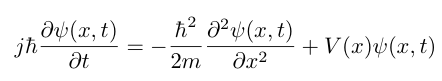
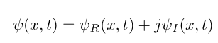
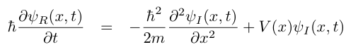
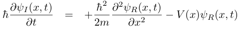

# the Time-Dependent Schrodinger Equation

The one-dimensional time-dependent Schrodinger equation 

break the wave-function into real and imaginary components 

## Use coupled partial differential equations

