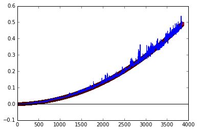

# Analysis of ITP Method

    import numpy as np
    import numpy.linalg as la
    import math as m
    import matplotlib.pyplot as plt
    from scipy.sparse.linalg import eigs
    %matplotlib inline

### Scipy Eigensolver

    data = np.genfromtxt('20141107215112.csv', delimiter=' ')
    n = data[:,0].size
    x = data[:,0]
    y_cgs = data[:,1]
    y_gmres = data[:,2]
    y_numpy = data[:,3]
    n

    3855

    from pylab import legend
    #p1, = plt.plot(x,y_cgs,'-s')
    # p2, = plt.plot(x,y_gmres,'-ob')
    p3, = plt.plot(x,y_numpy,'-sr')
    legend([p2,p3], ["gmres/cayley","numpy/LAPACK"], loc=0)
    plt.axhline(linewidth=1.0, color="black")
    plt.axvline(linewidth=1.0, color="black")

    <matplotlib.lines.Line2D at 0x10dc55150>

## Cubic Regression

    A = np.ones((n,4))
    for i in range(n):
        A[i,1] = x[i]
        A[i,2] = x[i]**2
        A[i,3] = x[i]**3
        
    
    [a_0,a_1,a_2,a_3] = la.solve(A.T.dot(A),A.T.dot(y_numpy))  
    
    indep_vec = np.linspace(0,n,1000)
    dep_vec = a_0+a_1*indep_vec + a_2*indep_vec**2+a_3*indep_vec**3
    plt.plot(indep_vec, dep_vec,"rs")
    plt.plot(x,y_numpy)
    plt.axhline(linewidth=1.0, color="black")
    plt.axvline(linewidth=1.0, color="black")
    a_0,a_1,a_2,a_3

    (-0.00025789608107682345,
     6.3836148313450383e-06,
     2.8116889658557751e-08,
     8.636431665781688e-13)

## Comparison of Python Solvers

    data = np.genfromtxt('20141107222318.csv', delimiter=' ')
    n = data[:,0].size
    x = data[:,0]
    y_numpy    = data[:,1]
    y_scipy    = data[:,2]
    y_cgs      = data[:,3]
    y_cho      = data[:,4]
    y_linsolve = data[:,5]
    y_scipysps = data[:,6]
    y_preinv   = data[:,7]
    y_eig      = data[:,8]
    n

    299

    from pylab import legend
    p1, = plt.plot(x,y_numpy)
    p2, = plt.plot(x,y_scipy)
    p3, = plt.plot(x,y_cgs)
    p4, = plt.plot(x,y_cho)
    p5, = plt.plot(x,y_linsolve)
    p6, = plt.plot(x,y_scipysps)
    p7, = plt.plot(x,y_preinv)
    legend([p1,p2,p3,p4,p5,p6,p7], ["numpy","scipy","cgs","cho","linsolve","sps","preinv"], loc=0)
    plt.axhline(linewidth=1.0, color="black")
    plt.axvline(linewidth=1.0, color="black")
    plt.xlabel('N (points)')
    plt.ylabel('Time (seconds)')

    <matplotlib.text.Text at 0x111863410>

    from pylab import legend
    p1, = plt.plot(x,y_cgs)
    p3, = plt.plot(x,y_eig)
    legend([p1,p3], ["cgs","eig"], loc=0)
    plt.axhline(linewidth=1.0, color="black")
    plt.axvline(linewidth=1.0, color="black")
    plt.xlabel('N (points)')
    plt.ylabel('Time (seconds)')

    <matplotlib.text.Text at 0x1118ea610>

    H = np.random.rand(100,100)
    H = H.T.dot(H)
    eps = 10E-6
    np.set_printoptions(precision=6,suppress=True)
     

    import scipy.sparse.linalg as spsla, math
    err = 1
    phi0 = np.random.rand(100)
    CayleyN = (np.identity(100)-0.5*H)
    CayleyP = (np.identity(100)+0.5*H)
    while(err > eps):
            phi1 = spsla.cgs(CayleyP,CayleyN.dot(phi0))
            phi1=phi1[0]
            mu = math.sqrt(phi1.dot(phi1))
            phi1 = phi1/mu  
            err = math.sqrt(2)*math.sqrt(abs(phi1.dot(H.dot(H)).dot(phi1)- (phi1.dot(H).dot(phi1))**2))
            phi0 = phi1
    
    cgs_gs = phi0
    cgs_gs

    array([ 0.105469,  0.111819,  0.108343,  0.097103,  0.103308,  0.099904,
            0.101077,  0.110508,  0.105576,  0.099191,  0.099625,  0.112531,
            0.107807,  0.093082,  0.097512,  0.097963,  0.106824,  0.100442,
            0.097109,  0.089203,  0.100226,  0.099393,  0.094939,  0.088765,
            0.095847,  0.111505,  0.094621,  0.10613 ,  0.11064 ,  0.108271,
            0.091129,  0.089501,  0.109635,  0.097362,  0.105906,  0.103086,
            0.086803,  0.089027,  0.094137,  0.09186 ,  0.096212,  0.087993,
            0.10469 ,  0.093279,  0.106576,  0.103994,  0.104228,  0.098227,
            0.094751,  0.087717,  0.10575 ,  0.091627,  0.101904,  0.096552,
            0.102246,  0.107257,  0.098107,  0.094247,  0.093377,  0.099111,
            0.095267,  0.102793,  0.094197,  0.107531,  0.098971,  0.096849,
            0.096547,  0.106539,  0.096307,  0.097326,  0.098839,  0.103016,
            0.099551,  0.113041,  0.093265,  0.097434,  0.106764,  0.099318,
            0.100298,  0.098141,  0.100743,  0.104255,  0.096578,  0.091716,
            0.095812,  0.100726,  0.108879,  0.095075,  0.102779,  0.101917,
            0.111361,  0.103818,  0.10021 ,  0.088952,  0.102571,  0.09346 ,
            0.095574,  0.102229,  0.099376,  0.101287])

    import scipy.sparse.linalg as spsla
    eig_gs = spsla.eigs(H,1)
    eig_gs[1][:,0]

    array([ 0.105469+0.j,  0.111819+0.j,  0.108343+0.j,  0.097103+0.j,
            0.103308+0.j,  0.099904+0.j,  0.101077+0.j,  0.110508+0.j,
            0.105576+0.j,  0.099191+0.j,  0.099625+0.j,  0.112531+0.j,
            0.107807+0.j,  0.093082+0.j,  0.097512+0.j,  0.097963+0.j,
            0.106824+0.j,  0.100442+0.j,  0.097109+0.j,  0.089203+0.j,
            0.100226+0.j,  0.099393+0.j,  0.094939+0.j,  0.088765+0.j,
            0.095847+0.j,  0.111505+0.j,  0.094621+0.j,  0.106130+0.j,
            0.110640+0.j,  0.108271+0.j,  0.091129+0.j,  0.089501+0.j,
            0.109635+0.j,  0.097362+0.j,  0.105906+0.j,  0.103086+0.j,
            0.086803+0.j,  0.089027+0.j,  0.094137+0.j,  0.091860+0.j,
            0.096212+0.j,  0.087993+0.j,  0.104690+0.j,  0.093279+0.j,
            0.106576+0.j,  0.103994+0.j,  0.104228+0.j,  0.098227+0.j,
            0.094751+0.j,  0.087717+0.j,  0.105750+0.j,  0.091627+0.j,
            0.101904+0.j,  0.096552+0.j,  0.102246+0.j,  0.107257+0.j,
            0.098107+0.j,  0.094247+0.j,  0.093377+0.j,  0.099111+0.j,
            0.095267+0.j,  0.102793+0.j,  0.094197+0.j,  0.107531+0.j,
            0.098971+0.j,  0.096849+0.j,  0.096547+0.j,  0.106539+0.j,
            0.096307+0.j,  0.097326+0.j,  0.098839+0.j,  0.103016+0.j,
            0.099551+0.j,  0.113041+0.j,  0.093265+0.j,  0.097434+0.j,
            0.106764+0.j,  0.099318+0.j,  0.100298+0.j,  0.098141+0.j,
            0.100743+0.j,  0.104255+0.j,  0.096578+0.j,  0.091716+0.j,
            0.095812+0.j,  0.100726+0.j,  0.108879+0.j,  0.095075+0.j,
            0.102779+0.j,  0.101917+0.j,  0.111361+0.j,  0.103818+0.j,
            0.100210+0.j,  0.088952+0.j,  0.102571+0.j,  0.093460+0.j,
            0.095574+0.j,  0.102229+0.j,  0.099376+0.j,  0.101287+0.j])

    abs(eig_gs[1][:,0]) - abs(cgs_gs)

    array([-0.,  0., -0.,  0.,  0., -0., -0., -0., -0.,  0., -0.,  0.,  0.,
            0.,  0.,  0., -0.,  0.,  0., -0.,  0.,  0., -0.,  0.,  0.,  0.,
           -0.,  0., -0., -0.,  0.,  0., -0., -0., -0., -0., -0., -0.,  0.,
           -0.,  0., -0.,  0., -0., -0.,  0., -0.,  0.,  0., -0., -0.,  0.,
           -0., -0., -0., -0.,  0.,  0.,  0., -0.,  0.,  0.,  0., -0., -0.,
           -0.,  0., -0.,  0.,  0.,  0.,  0., -0., -0.,  0., -0., -0.,  0.,
           -0.,  0.,  0.,  0.,  0.,  0., -0., -0., -0., -0.,  0.,  0.,  0.,
            0., -0.,  0.,  0.,  0.,  0., -0.,  0., -0.])

    
