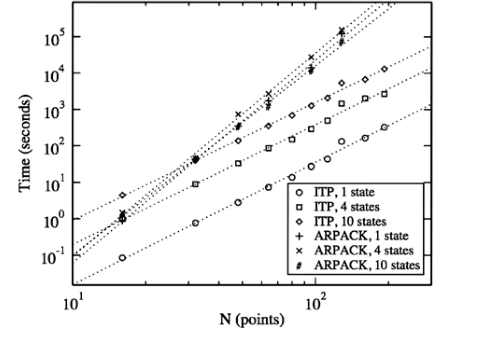
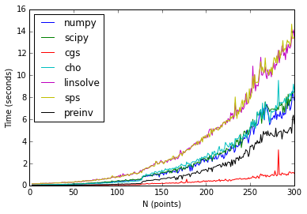
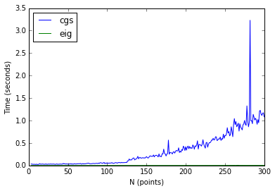

# Mathematial Preliminaries
The following comprise the mathematics of quantum mechanics. 

\paragraph{Eigenproblems}
An eigenproblem is a relationship describing a vector or function that is invariant with respect to a given linear operator. Given an operator $\Gamma: \mathbb{F}^n \to \mathbb{F}^n$, where $\mathbb{F}^n$ represents either the Real or Complex field of dimenion $n$, $\Gamma$ is said to be in the set of linear operators over the space $\mathbb{F}^n$. Then, $\lambda$ and $\psi$ are said to be an eigenvalue and eigenvector respectively of the linear operator $\Gamma$, if $\lambda\in\mathbb{F}$, $\psi\neq0$ and 

$$\Gamma\psi=\lambda\psi$$

\paragraph{Boundary Value Problems} All quantum mechanics problems are boundary value problems. A solution to a boundary value problem is a solution to the differential equation which also satisfies the boundary conditions. In general, either a bound potential or a suitable boundary condition is required for quantization. A quantum mechanical problem with no boundary conditions will produce a continuous spectrum solution and is not well defined. 

\paragraph{the Laplace Equation} For a chosen set of variables (Cartesian, Spherical), the Laplace equation represents a steady-state solution for a spatial arrangement of values. It is a partial differential equation, meaning that its solutions will be function of more than one variable. The Laplace equation is unique in that typically all of its variables represent spatial rather than temporal variables. As such it is said to describe a steady state. It is an elliptic partial differential equation. 

Using the Laplacian notation, $\Delta = \frac{\partial^2}{\partial^2 x} +\frac{\partial^2}{\partial^2 y} + \frac{\partial^2}{\partial^2 z}$ for Cartesian coordinates, it is possible to state the Laplace equation quite eloquently as 

$$\Delta \psi = 0$$

For our purposes, the variables associated with the solution function are taken to be independent from each other and can thus be solved by a separation of variables technique. 

\begin{align*}
\Delta \psi &= \psi_{xx}+\psi_{yy} = 0 \tag{in two dimensions}\\
X''Y+XY''&=0\\
\frac{X''}{X}&=-\frac{Y''}{Y}
\end{align*}

Because the two variables are independent from each other, they remain constant with respect to each other's derivatives. The problem then becomes an eigenproblem of the form $X''-X=\lambda$, where $\lambda$ is a constant eigenvalue. 

\paragraph{Spectral Theory}
The spectrum of the Laplace operator is the set of all eigenvalues $\lambda$ for which there is a corresponding eigenfunction $\psi$ so that 

$$-\Delta \psi = \lambda \psi$$

If $\Omega$ is a bounded domain in $\mathbb{R}^n$, then the eigenfunctions of the Laplacian are an orthonormal basis for the Hilbert Space $L^2(\Omega)$. 

\paragraph{Complete Basis Set}
In a particular space a list of vectors or functions that is linearly independent and spans the space. 

\paragraph{Linear Combination}
Given a complete set of basis functions, it is possible to write a wavefunction describing the state of a system as a linear combination of this basis set. In other words,

$$\psi(\mathbf{r})=\sum_{i=1}^\infty c_i\phi_i$$

where $\Gamma \phi_i = a_i\phi_i$.

\paragraph{Braket notation}
In quantum mechanics, we use the bra-ket notation as a standard notation for describing quantum states. It represents the inner product of two states (mathematically, two functions).

$$\left\langle \psi | \phi \right\rangle = \int_\Omega \psi\phi\ d\tau$$

$$\left\langle \psi |\Gamma| \phi \right\rangle = \int_\Omega \psi\Gamma\phi\ d\tau$$

\paragraph{Operator}
In quantum mechanics, every physical observable (e.g. momentum, energy) has its own associated operator. An operator is a functional mapping from a space to itself that is closed under vector addition and scalar multiplication. 

In quantum mechanics, all operators are self-adjoint or Hermitian. Each operator has associated eigenfunctions or eigenvectors and eigenvalues. The self-adjointness of the operators ensures that the associated eigenfunctions are normal and orthogonal to each other and that the eigenvalues are real.  

$$\left\langle \psi_j | \psi_k \right\rangle =\left\{
     \begin{array}{lr}
       1 & : j = k\\
       0 & : j \neq k
     \end{array}
   \right. = \delta_{jk} 
 $$

\paragraph{Expectation}
In quantum mechanics, the expectation value of an operator is the probabilistic expected value of the result of an experiment. It is not the most probable value of a measurement. 

A particular state is described by a normalized wavefunction (vector in Hilbert space), say $\psi$. The expectation value of an operator, say $\Gamma$, in this state
is given by the inner product $\left\langle \psi |\Gamma| \phi \right\rangle$. 

If $\psi$ is an eigenfunction of $\Gamma$, then the expectation value of $\Gamma$ is equation to the eigenvalue corresponding to $\psi$, $\lambda$.

$$\Gamma\psi = \lambda\psi \implies \left\langle \Gamma \right\rangle = \lambda$$

# Molecular Quantum Mechanics

\paragraph{Hamiltonian Operator}
Classically, the Hamiltonian corresponds to the total energy of a system. The Hamiltonian operator is the corresponding quantum mechanical operator and is equal to the sum of the kinetic and potential energy operators.

\begin{align*}
H&=T+V=-\frac{\hbar^2}{2m}\nabla^2 + V\\
\end{align*}

The expectation value of the Hamiltonian operator is an associated energy, $E$ that is totally conserved. 

\paragraph{Schr{\"o}dinger's equation} 

In the standard interpretation of quantum mechanics, the wave function is the most complete description that can be given of a physical system. Solutions to Schr&ouml;dinger's equation describe not only molecular, atomic, and subatomic systems, but also macroscopic systems, possibly even the whole universe. Solutions are sets of eigenfunctions representing quantum states and corresponding eigenvalues representing energy levels. 

The time-independent Schr&ouml;dinger equation is

$$H\psi(\mathbf{r})=E\psi(\mathbf{r})$$

The time-dependent Schr&ouml;dinger is 

$$i \hbar \frac{\partial}{\partial t}\Psi(t,\mathbf{r}) = H \Psi(t,\mathbf{r})$$

## Quantum Superposition
Because the Schr&ouml;dinger equation is linear, any linear combination of pure state solutions to a particular equation will also be a pure state solution of it. These linear combinations are also made to be orthogonal to each other. In other words, the overlap of the states is nullified and the expectations of an operator is the sum of the expectation values of the operator in the individual states multiplied by the fraction of the superposition states that is in the measured state. 

Resolution into orthogonal components is the basis of Quantum measurement. 

## Particle in a Box

The simplest characterization of a quantum system is the so called "Particle in a Box" problem in one dimension. Here, the potential energy within a confined range (say from 0 to $a$) is set to zero and the potential energy outside of the range, infinite. The Hamiltonian then becomes

 \begin{displaymath}
   H = T + V =  \left\{
     \begin{array}{lr}
       -\frac{\hbar^2}{2m}\nabla^2 & : x \in (0,a)\\
       0 & : x \notin (0,a)
     \end{array}
   \right.
\end{displaymath}

Note that this characterization provides the boundary conditions required for quantization, namely that $\psi(0)=\psi(a)=0$. We can use these bounds to solve the time-independent Schr&ouml;dinger equation.

\begin{align*}
H\psi(x) &= E\psi(x)\\
\psi''(x)&= \lambda^2\psi(x)\ \ \ \ \lambda=\frac{\sqrt{2mE}}{\hbar}
\end{align*}

This equation has solutions of the form $\psi(x)=A\sin(\lambda x)$ where $\lambda =\frac{n\pi}{a}$, $n\in\mathbb{N}$. The requirement of normality built-in to the self-adjointness of $H$ can be used to find $A$.

\begin{align*}
\left\langle A\sin\left(\frac{n\pi}{a} x\right) | A\sin\left(\frac{n\pi}{a} x\right)\right\rangle = 1\implies A =\sqrt{\frac{2}{a}}
\end{align*} 

Then, we have the eigenfunctions, $\psi(x)=\sqrt{\frac{2}{a}}\sin\left(\frac{n\pi}{a} x\right)$ with corresponding energy levels $E=\frac{n^2\pi^2\hbar^2}{2ma^2}$.

\begin{figure}[h]
\centering
\includegraphics[width=3in]{img/1dbox.png}
\caption{Particle in a 1-D Box}
\end{figure}

This solution can be generalized to two- and three-dimensions. It is mildly interesting to think about this drastic oversimplification and the Bohr model of the atom. 

\pagebreak

# Computational Mathematics

## Notes on Software 
In practice, Dr. Eloranta does all of his calculations using the C programming language and various linear algebra libraries written in Fortran, using custom C wrappers to these libraries. For the purposes of learning the algorithms as opposed to rigorous programming the bulk of my work in Dr. Eloranta's lab was done in Python, primarily through the IPython interactive terminal and the IPython notebook web server. Instructions on setting up IPython Notebook on a Macintosh can be found [here](https://joshuacook.github.io/blog/2014/12/20/ipython-clean-install/). 

Pandoc was (and is) used to render "final" pdfs of the work done. Pandoc files were written in a hybrid of markdown (for document formatting) and Latex (for math rendering) that mirror the presentation format of IPython Notebooks.

### IPython Notebook
The [IPython Notebook](http://ipython.org/notebook.html) is a web-based interactive computational environment where you can combine code execution, text, mathematics, plots and rich media into a single document. 

These notebooks are normal files that can be shared with colleagues, converted to other formats such as HTML or PDF, etc. You can share any publicly available notebook by using the [IPython Notebook Viewer](http://nbviewer.ipython.org/) service which will render it as a static web page. This makes it easy to give your colleagues a document they can read immediately without having to install anything.

### Pandoc
If you need to convert files from one markup format into another, pandoc is your swiss-army knife. [Pandoc](http://johnmacfarlane.net/pandoc/) can convert documents in markdown, reStructuredText, textile, HTML, DocBook, LaTeX, MediaWiki markup, TWiki markup, OPML, Emacs Org-Mode, Txt2Tags, Microsoft Word docx, EPUB, or Haddock markup to

- HTML formats: XHTML, HTML5, and HTML slide shows using Slidy, reveal.js, Slideous, S5, or DZSlides.
- Word processor formats: Microsoft Word docx, OpenOffice/LibreOffice ODT, OpenDocument XML
- Ebooks: EPUB version 2 or 3, FictionBook2
- Documentation formats: DocBook, GNU TexInfo, Groff man pages, Haddock markup
- Page layout formats: InDesign ICML
- Outline formats: OPML
- TeX formats: LaTeX, ConTeXt, LaTeX Beamer slides
- PDF via LaTeX
- Lightweight markup formats: Markdown, reStructuredText, AsciiDoc, MediaWiki markup, DokuWiki markup, Emacs Org-Mode, Textile
- Custom formats: custom writers can be written in lua.

## Representing Mathematics Computationally
Consider the derivative:

$$f'(x)=\lim_{h\to 0} \frac{f(x+h)-f(x)}{h}$$

It is not possible to represent a function $f: $\mathbb{R} \to \mathbb{R}$ computationally because computers are discrete in nature and require discrete representation. Computationally, we must consider precisely what it means to say, "`h` goes to `0`."

##  Discrete Representation of Functions
In this work, we use `numpy` and it's build-it array functionality to represent functions as vectors.

## Build arrays to represent functions

~~~
In [1]: import numpy as np

In [2]: indep_vec = np.linspace(0,1,11)

In [3]: f = lambda x : x

In [4]: g = lambda x : x**2

In [5]: h = lambda x : x**3

In [6]: l_vec = f(indep_vec)

In [7]: q_vec = g(indep_vec)

In [8]: c_vec = h(indep_vec)

In [9]: l_vec
Out[9]: array([ 0. ,  0.1,  0.2,  0.3,  0.4,  0.5,  0.6,  0.7,  0.8,  0.9,  1. ])

In [10]: q_vec
Out[10]: array([ 0.  ,  0.01,  0.04,  0.09,  0.16,  0.25,  0.36,  0.49,  0.64, 
                 0.81,  1.  ])

In [11]: c_vec
Out[11]: array([ 0.   ,  0.001,  0.008,  0.027,  0.064,  0.125,  0.216,  0.343, 
                 0.512,  0.729,  1.   ])
~~~

To calculate first and second derivatives of functions using finite differences, we will approximate First Derivative using Finite Differences. We seek: 

~~~
lin_prm_vec = [1,1,1,...,1]
qud_prm_vec = [0,0.2,0.4,...,2]
cub_prm_vec = [0,0.03,0.12,...,3]
con_prm_vec = [0,0,0,...,0]
~~~

###  Finite Differences

Consider: 
$$f'(x) \approx \frac{f(x+h)-f(x)}{h}$$

Also:
$$f'(x) \approx \frac{f(x)-f(x-h)}{h}$$

But the best estimate will typically be

$$f'(x) \approx \frac{f(x+h)-f(x-h)}{2h}$$

###  Linear First Difference

Note that the ith element of `lin_prm_vec` with `h+0.1` will be

`lin_prm_vec[i] = [linear_vec[i+1]]-linear_vec[i-1]/2*h`

`lin_prm_vec[1] = [linear_vec[2]-linear_vec[0]]/2*h`

`lin_prm_vec[2] = [linear_vec[3]-linear_vec[1]]/2*h`

###  Toward First Difference Operator

Let `D = d/dx`, Then `Df = f'`.

Here `D` is an operator, namely the first derivative.  Seek `FD` a matrix operator that approximates the first derviative of a vector using first finite difference,
i.e. `FD*linear_vec = lin_prm_vec`. We temporarily ignore boundary conditions.

$$
\frac{1}{2h}
\left(
\begin{matrix}
 0  &  1  &  0  &    \dots  &  0  &  0 \\
-1  &  0  &  1  &    \dots  &  0  &  0 \\
 0  & -1  &  0  &    \dots  &  0  &  0 \\
 \vdots & \vdots&  \vdots&  \vdots&  \vdots& \vdots\\ 
 0  &  0  &  \dots  &    0  &  1  &  0 \\
 0  &  0  &  \dots  &    -1  &  0  &  1 \\
 0  &  0  &  \dots &    0  & -1  &  0
\end{matrix}
\right)
\left(
\begin{matrix}
0.0 \\
0.1 \\
0.2 \\
0.3 \\
0.4 \\
0.5 \\
0.6 \\ 
0.7 \\
0.8 \\
0.9 \\
1.0
\end{matrix}
\right)=
\left(
\begin{matrix}
 - \\
1.0 \\
1.0 \\
1.0 \\
1.0 \\
1.0 \\
1.0 \\ 
1.0 \\
1.0 \\
1.0 \\
 -
\end{matrix}
\right)
$$

~~~
         |  0  1  0  0  0  0  0  0  0  0  0 | |0.0| = |-|
         | -1  0  1  0  0  0  0  0  0  0  0 | |0.1| = |1| 
         |  0 -1  0  1  0  0  0  0  0  0  0 | |0.2| = |1|
         |  0  0 -1  0  1  0  0  0  0  0  0 | |0.3| = |1|
         |  0  0  0 -1  0  1  0  0  0  0  0 | |0.4| = |1|
1/(2*h)  |  0  0  0  0 -1  0  1  0  0  0  0 | |0.5| = |1|
         |  0  0  0  0  0 -1  0  1  0  0  0 | |0.6| = |1|
         |  0  0  0  0  0  0 -1  0  1  0  0 | |0.7| = |1|
         |  0  0  0  0  0  0  0 -1  0  1  0 | |0.8| = |1|
         |  0  0  0  0  0  0  0  0 -1  0  1 | |0.9| = |1|
         |  0  0  0  0  0  0  0  0  0  1  0 | |1.0| = |-|
~~~
\pagebreak

###  Toward Second Difference Operator

Let `D2 = d^2/dx^2`

Consider 

\begin{align*}
f''(x) &\approx \frac{f'(x+h)-f'(x-h)}{2h}\\
&\approx \frac{\frac{f(x+h)-f(x)}{2h}-\frac{f(x)-f(x-h)}{2h}}{2h}\\
&\approx \frac{f(x+h) - 2f(x) + f(x-h)}{h^2}\tag{with $2h$ recast as $h$}
\end{align*}
~~~
         | -2  1  0  0  0  0  0  0  0  0  0 | |0.00| = |-|
         |  1 -2  1  0  0  0  0  0  0  0  0 | |0.01| = |2| 
         |  0  1 -2  1  0  0  0  0  0  0  0 | |0.04| = |2|
         |  0  0  1 -2  1  0  0  0  0  0  0 | |0.09| = |2|
         |  0  0  0  1 -2  1  0  0  0  0  0 | |0.16| = |2|
1/(h^2)  |  0  0  0  0  1 -2  1  0  0  0  0 | |0.25| = |2|
         |  0  0  0  0  0  1 -2  1  0  0  0 | |0.36| = |2|
         |  0  0  0  0  0  0  1 -2  1  0  0 | |0.49| = |2|
         |  0  0  0  0  0  0  0  1 -2  1  0 | |0.64| = |2|
         |  0  0  0  0  0  0  0  0  1 -2  1 | |0.81| = |2|
         |  0  0  0  0  0  0  0  0  0  1 -2 | |1.00| = |-|
~~~

\pagebreak

### Short Program to Create Second Difference Matrix

The following code snippet builds second difference matrices. Note that way in which boundary conditions are handled. 

~~~
import numpy as np
import scipy.sparse as sprs

def secondDiff(type,n=10,sparse=False):
    '''
    secondDiff Create finite difference model matrix.
    D = secondDiff(TYPE,N,SPARSE) creates model matrix TYPE of size N-by-N.

    TYPE is one of the characters 'D', 'M', 'N', or 'C'.
    The command D = secondDiff('D', 100, 1) gives a sparse representation
    D = secondDiff uses the defaults TYPE='D', n=10, and SPARSE=False.
    Change the 3rd argument from 1 to 0 for dense representation!
    If no 3rd argument is given, the default is dense
    If no argument at all, secondDiff will give 10 by 10 matrix D
    '''

    e = np.ones(n)
    e_off = np.ones(n-1)
    D = sprs.diags([e_off,-2*e,e_off],[-1,0,1])

    if str(type) == 'D': 			# Dirichlet boundary conditions
        D = D
    if str(type) == 'M': 			# Mixed boundary conditions
        D = sprs.csr_matrix(D)
        D[0,0] = -1
    if str(type) == 'R': 			# Robin boundary conditions
        D = sprs.csr_matrix(D)
        D[0,0] = -1
        D[n-1,n-1] = -1
    if str(type) == 'C':			# Circular boundary conditions
        D = sprs.csr_matrix(D)
        D[0,n-1] = 1
        D[n-1,0] = 1

    if sparse == False:
        return D.todense()
    else:
        return D
        
~~~

Ignore those horrible, horrible boundary conditions but do consider the following:

~~~
In [1]: import secondDiff

In [2]: import numpy as np

In [3]: D8 = secondDiff.secondDiff('D',8)

In [4]: print D8.dot(np.array([1,1,1,1,1,1,1,1]))
[[-1.  0.  0.  0.  0.  0.  0. -1.]]

In [5]: print D8.dot(np.array([1,2,3,4,5,6,7,8]))
[[ 0.  0.  0.  0.  0.  0.  0. -9.]]

In [6]: print D8.dot(np.array([1,4,9,16,25,36,49,64]))
[[  2.   2.   2.   2.   2.   2.   2. -79.]]

In [7]: print D8.dot(np.array([1,8,27,64,125,216,343,512]))
[[   6.   12.   18.   24.   30.   36.   42. -681.]]
~~~

\pagebreak

## Finite Difference Solution to Differential Equation with Dirichlet Boundary Conditions

**Example** Solve the differential and difference equations with constant force $f(x)=1$ and fixed ends $u(0)=u_0=u(1)=u_1=0$. 

\begin{align*}
-\frac{d^2u}{dx^2}&=1\ \ \ \text{with} \ \ \ u(0)=0 \ \ \ \text{and}\ \ \ u(1)=0\\
\frac{-u_{i+1}+2u_1-u_{i-1}}{h^2}&=1\ \ \ \text{with} \ \ \ u_0=0 \ \ \ \text{and}\ \ \ u_{n+1}=0
\end{align*}

### Analytic solution to differential equation
$$u(x)=\frac12x-\frac12x^2$$

    def fixedFixedPlot(anlyt_soln,force_vec,xi,xf,h,density,should_I_plot=True):
        # independent vector for diffy
        u_ind_vec = np.linspace(xi,xf,density)
        
        # plot differential equation
        if (should_I_plot == True): plt.plot(u_ind_vec,u(u_ind_vec))
        
        # difference equation solution
        D = h**2*secondDiff('D',h-1)
        soln = nla.solve(D,force_vec)
        soln = np.insert(soln,0,0)
        soln = np.insert(np.zeros(1),0,soln)
        soln_ind_vec = np.linspace(0,1,h+1)
    
        # plot difference equation
        if (should_I_plot == True): plt.plot(soln_ind_vec,soln)
        
        return soln_ind_vec, soln, u_ind_vec, u(u_ind_vec)
    
    u = lambda x: 0.5*x - 0.5*x**2
    f3 = np.ones(3)
    f6 = np.ones(6)
    f9 = np.ones(9)
    
    vecs_1 = fixedFixedPlot(u,f3,0,1,4,500, False)
    vecs_2 = fixedFixedPlot(u,f6,0,1,7,500, False)
    vecs_3 = fixedFixedPlot(u,f9,0,1,10,500, False)
    
    fig, (ax1,ax2,ax3) = plt.subplots(figsize=(15,5),ncols=3)
    ax1.plot(vecs_1[0],vecs_1[1])
    ax1.plot(vecs_1[2],vecs_1[3])
    ax2.plot(vecs_2[0],vecs_2[1])
    ax2.plot(vecs_2[2],vecs_2[3])
    ax3.plot(vecs_3[0],vecs_3[1])
    ax3.plot(vecs_3[2],vecs_3[3])
    
    print vecs_1[1]
    print vecs_2[1]
    print vecs_3[1]

    [ 0.       0.09375  0.125    0.09375  0.     ]
    [ 0.          0.06122449  0.10204082  0.12244898  0.12244898  0.10204082
      0.06122449  0.        ]
    [ 0.     0.045  0.08   0.105  0.12   0.125  0.12   0.105  0.08   0.045  0.   ]

\pagebreak

## Finite Difference Solution to Differential Equation with Mixed Boundary Conditions

### Free-Fixed

Solve the differential and difference equations with constant force $f(x)=1$ and one free end $u'(0)=0$ and one fixed end $u(1)=u_1=0$. 

\begin{align*}
-\frac{d^2u}{dx^2}&=1\ \ \ \text{with} \ \ \ \frac{du}{dx}(0)=0 \ \ \ \text{and}\ \ \ u(1)=0\\
\frac{-u_{i+1}+2u_1-u_{i-1}}{h^2}&=1\ \ \ \text{with} \ \ \ \frac{u_1-u_0}{h}=0 \ \ \ \text{and}\ \ \ u_{n+1}=0
\end{align*}

### Analytic solution to differential equation
\begin{align*}
u_p(x)&=-\frac12x^2\\
u_c&=Cx+D\\
u(x)&=D+Cx-\frac12x^2\\
u'(x)&=C-x\\
u'(0)&=0\implies C = 0\\
u(1)&=0\implies D = \frac12\\
u(x)&=\frac12-\frac12x^2
\end{align*}

### Free-Fixed Difference Matrix
Free-fixed boundary conditions mean we use $T_n$

    def freeFixedPlot(anlyt_soln,force_vec,xi,xf,h,density,should_I_plot=True):
        # independent vector for diffy
        u_ind_vec = np.linspace(xi,xf,density)
        
        # plot differential equation
        if (should_I_plot == True): plt.plot(u_ind_vec,anlyt_soln(u_ind_vec))
        
        # difference equation solution
        T = h**2*KTBC('T',h-1)
        soln = nla.solve(T,force_vec)
        soln = np.insert(soln,0,soln[0])
        soln = np.insert(np.zeros(1),0,soln)
        soln_ind_vec = np.linspace(0,1,h+1)
    
        # plot difference equation
        if (should_I_plot == True): plt.plot(soln_ind_vec,soln)
        
        return soln_ind_vec, soln, u_ind_vec, anlyt_soln(u_ind_vec)
    
    v = lambda x: 1./2-1./2*x**2
    
    vecs_4 = freeFixedPlot(v,f3,0,1,4,500, False)
    vecs_5 = freeFixedPlot(v,f6,0,1,7,500, False)
    vecs_6 = freeFixedPlot(v,np.ones(29),0,1,30,500, False)
    
    fig, (ax1,ax2,ax3) = plt.subplots(figsize=(15,5),ncols=3)
    ax1.plot(vecs_4[0],vecs_4[1])
    ax1.plot(vecs_4[2],vecs_4[3])
    ax2.plot(vecs_5[0],vecs_5[1])
    ax2.plot(vecs_5[2],vecs_5[3])
    ax3.plot(vecs_6[0],vecs_6[1])
    ax3.plot(vecs_6[2],vecs_6[3])
    

\pagebreak

# Solving Molecular Quantum Mechanics Problems Computationally 

At its essence the work in Dr. Eloranta's lab is an extension of the simple power method for finding an eigenvector. 

## Simple Power Method

1. Choose a starting vector $\mathbf{x}^{(0)}\in\mathcal{R}^n$ with
$||\mathbf{x}^{(0)}||=1$.
2. $k=0$
3. `while` some convergence criteria is not satisfied

    i. $k:=k+1$
    ii. $\mathbf{y}^{(k)}:=A\mathbf{x}^{(k-1)}$
    iii. $\mu_k:=||\mathbf{y}^{(k)}||$
    iv. $\mathbf{x}^{(k)}:=\mathbf{y}^{(k)}/\mu_k$

~~~
    import numpy.linalg, numpy.random, numpy as np, math
    from random import random as rand
    from numpy.linalg import eig

    B = numpy.array([[2,-12],[1,-5]])
    y = numpy.array([1,1])
    x = y
    for i in range(100):
        y = B.dot(x)
        mu = math.sqrt(y.dot(y))
        x = y/mu
    print numpy.transpose(eig(B)[1])
    print x

    [[ 0.9701425   0.24253563]
     [ 0.9486833   0.31622777]]
    [ 0.9486833   0.31622777]

    A = numpy.random.rand(3,3)
    x = numpy.random.rand(3)
    for i in range(20):
        y = A.dot(x)
        mu = math.sqrt(y.dot(y))
        x = y/mu
    np.transpose(eig(A)[1]),x

    (array([[ 0.51063895,  0.65312477,  0.55917429],
            [ 0.87551464, -0.17084359, -0.45198073],
            [-0.00620138, -0.53208609,  0.84666755]]),
     array([ 0.51063895,  0.65312477,  0.55917429]))
~~~

\pagebreak

# Applications of Imaginary Time Propagation Method in Material Research
As presented at NSF PREM Colloquium.

Helium droplets not only provide a unique matrix environment for high resolution spec- troscopy and studying molecular solvation but also allow to use guest molecules as probes of the surrounding quantum medium.1–3 After the initial discovery of the helium droplet tech- nique for spectroscopic applications, attention quickly turned into characterizing the physical properties of the helium droplets themselves. The groundbreaking experiments by the Toen-nies group employed the glyoxal molecule as a probe to study the helium droplet response through optical absorption spectrum.

## the Imaginary Time Propagation

The imaginary time propagation method (ITP) relies on solving the
time-dependent Schrödinger equation in imaginary time. We perform a Wick Rotation (setting $t=-i\tau$) to transform the time-dependent Schrödinger into a simple diffusion equation

\begin{equation}
\label{eq:itpSch}
\frac{\partial \psi(r,\tau)}{\partial
\tau}=-\frac{\hat{H}}{\hbar}\psi(r,\tau) \implies \psi(r,\tau)=\exp(-\hat{H}\tau/\hbar)\psi(r,0)
\end{equation}

\paragraph{Iterative Solutions to Eigenproblems}This can be thought of as the analog to a power solution or subspace iteration. As $\tau\to\infty$, $\psi(r,\tau)$ will converge on the eigenfunction for the ground state.

In practice, a random vector is chosen as the initial state. A time-propagation will yield the ground state eigenvector. If a vector other than the ground state is desired, $N$ separate wave functions are propagated. Each higher state eigenvector is required to be orthogonal to the lower eigenvectors and are thus discovered through the iterative process. Approximate orthogonality is enforced in the following way.

\begin{equation}
\label{eq:appxOrth}
\frac{\partial\psi_i(r,\tau)}{\partial\tau} = -\frac{\hat{H}}{\hbar}\psi(r,\tau)-\lambda\sum_{j < i}^N |\langle \psi_j(r,\tau)|\psi_i(r,\tau)\rangle|^2
\end{equation}

\paragraph{} In order to implement the solution computationally, the exponential
operator is approximated using the Cayley unitary form, transforming the eigenvalue problem into a linear problem:

\begin{align*}
\label{eq:CayleyExpansion}
\exp(-H\Delta\tau)\approx\left(1+\frac{1}{2}H\Delta\tau\right)^{-1}\left(1-\frac{1}{2}H\Delta\tau\right) \\ 
\implies \left(1+\frac{1}{2}H\Delta\tau\right)\psi(r,\tau+\Delta\tau)=\left(1-\frac{1}{2}H\Delta\tau\right)\psi(r,\tau)
\end{align*}

\paragraph{Stopping Criteria}
A formula for the absolute error, $\Delta E_i$ present in $E_i(\tau)$ can be written in terms of the quantum mechanical standard deviation of $H$ and is used as a stopping criteria.

\begin{equation}
\label{eq:error}
\Delta E_i = |E_i -\langle\psi_i(r,\tau)|H|\psi_i(r,\tau)|\leq\sqrt{2}\sqrt{\langle\psi_i(r,\tau)|H^2|\psi_i(r,\tau)\rangle-\langle\psi_i(r,\tau)|H|\psi_i(r,\tau)\rangle^2}
\end{equation}

\section*{Results}
The ITP method reduces the solving of an eigenproblem to an iterative power solution via the solution of a linear equation. 
% ITP is being implemented in practice parallelized, using C and openBLAS. 
In current practice has been shown to have better scalability than the implicitly restarted Lanczos method as implemented in ARPACK. 

For the purposes of training, the algorithm is being reimplemented in Python and Numpy/Scipy. The solution of the linear equation being the most computationally expensive, theoretically involving a matrix inversion at each iteration, seven linear solution schemes were speed-tested versus Numpy's built-in eigensolver: the Numpy solver, the Scipy solver, Scipy's conjugate gradient squared (CGS) solver, a Cholevsky decomposition method, two of Scipy's sparse solvers, and a pre-inversion of the matrix iterated. 

The CGS solver was found to be the fastest. In comparison to the built-in eigensolver, however, it falls well short of reasonable performance standards. Furthermore, the CGS method has been found to be the least stable of the methods (note the spike at $N\approx 280$).

\pagebreak

\section*{Applications to Bosonic Density Functional Theory}

Helium clusters were modeled by the Orsay-Trento DFT (OT-DFT) and the
interaction with the guest molecule was included through an external
potential. To compute the effective moment of inertia of the
molecule--helium complex, we include an additional energy term of the
form $-\omega L_z$ and compute the ``rotating'' groundstate energy by
minimizing

\begin{equation}
\label{eq:OTDFT}
E[\Psi,\omega]=\int\left\{\frac{\hbar^2}{2m}|\nabla\Psi|^2+\epsilon_{OT}[\Psi]+V_{X-\text{He}}|\Psi|^2-\omega \Psi*L_z\Psi\right\}
\end{equation}

The non-linear Schrödinger-type equation arising from the minimization
of eq. 4 is solved by means of imaginary time propagation.

\section*{Bosonic Density Functional Theory}
In the experiment, bosonic density functional theory (DFT) is the method used to obtain calculated rotational constant values.  Density functional theory is a technique that plays an important role in determining the key components that can explain why the moment of inertia decreases when rotational superfluidity takes place. The results obtained using DFT are compared with experimental data and Quantum Monte Carlo (QMC) values and there is a similar agreement which is shown by the appearance firs-turn over point.  

The first minimum appearing in molecular rotational constants as a function of helium droplet size has been previously associated with the onset of superfluidity in these finite systems. We investigate this relationship by bosonic density functional theory calculations of classical molecular rotors (OCS, N2O, CO and HCN) interacting with the surrounding helium. The calculated rotational constants are in fair agreement with the existing experimental data, demonstrating the applicability of the theoretical model. By inspecting the spatial evolution of the global phase and density, the increase in the rotational constant after the first minimum is shown to correlate with continuous coverage of the molecule by helium and appearance of angular phase coherence rather than completion of the first solvent shell. We assign the observed phenomenon to quantum phase transition between a localized state and one-dimensional superfluid, which represents the onset of rotational superfluidity in small helium droplets.
